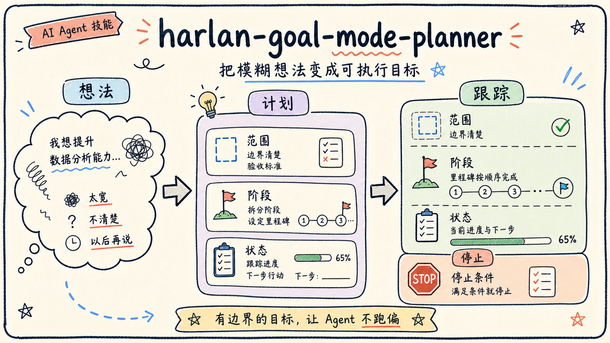
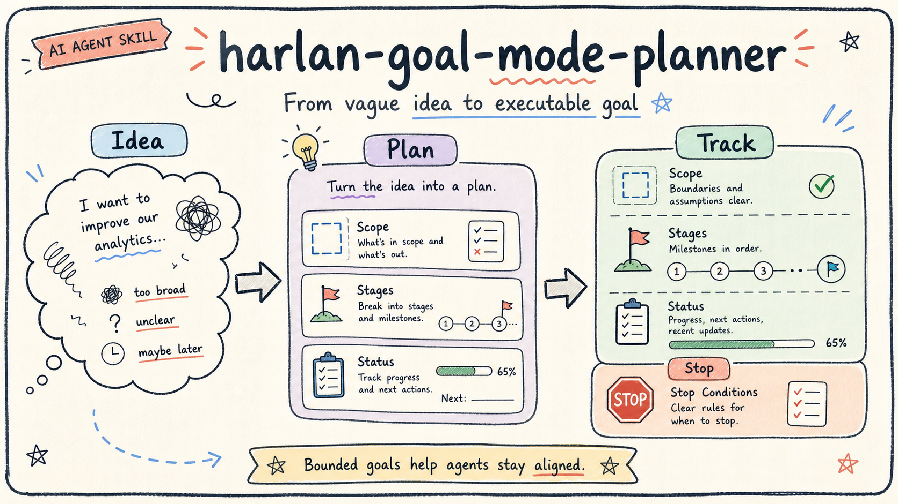

# harlan-goal-mode-planner



把模糊想法整理成适合 AI Agent 长时间执行的清晰目标。

很多 Agent 任务失败，不是因为模型不够强，而是因为目标太宽、边界不清、没有阶段、没有验收标准，也没有停止条件。`harlan-goal-mode-planner` 用来把这些模糊意图整理成更可执行、可跟踪、可停止的 Goal。

## 适合什么时候用

- 你有一个想法，但还没有整理成可执行目标。
- 你已经写了 Goal，但担心它太宽、太空或容易跑偏。
- 你需要为长期任务补充分阶段计划、状态跟踪和验收标准。
- 你希望明确哪些判断应该交给使用者确认，而不是让 AI 自己决定。

## 你可以这样说

```text
请使用 harlan-goal-mode-planner，把这个目标整理成适合 Goal Mode 执行的版本。
```

```text
请诊断这个 Goal 是否边界清楚、阶段合理、验收标准明确。
```

```text
我想长期整理自己的内容资产，请先帮我把这个想法改写成一个可执行 Goal。
```

## 它会帮你整理什么

- 目标背景
- 最终目标
- 当前阶段
- 可用输入
- 范围和不做什么
- 分阶段计划
- 状态跟踪表
- 交付物
- 验收标准
- 停止条件
- 需要使用者确认的判断点

## 使用方式

把整个 `harlan-goal-mode-planner` 文件夹复制到你的 AI 工具 Skills 目录中，然后提供你的目标草稿或模糊想法。

以 Codex 为例：

```bash
cp -R skills/harlan-goal-mode-planner ~/.codex/skills/harlan-goal-mode-planner
```

如果你的工具不支持自动加载 Skills，也可以直接打开 `SKILL.md`，把里面的规则交给 AI 使用。

## 目录说明

- `SKILL.md`：目标诊断和改写规则。
- `agents/openai.yaml`：展示信息。
- `assets/goal-mode-planner-card-zh.png`：中文 README 配图。
- `assets/goal-mode-planner-card-en.png`：英文 README 配图。

---

## English



Turn vague intentions into executable long-running goals for AI agents.

Many agent tasks fail not because the model is weak, but because the goal is too broad, lacks boundaries, has no stages, has no acceptance criteria, and never says when to stop. `harlan-goal-mode-planner` helps convert rough intentions into goals that are executable, trackable, and bounded.

## When to Use

- You have an idea but not an executable goal.
- You already wrote a Goal but it may be too broad or vague.
- You need stages, progress tracking, acceptance criteria, and stop conditions.
- You want to separate what the agent can organize from what the user must decide.

## Example Prompts

```text
Use harlan-goal-mode-planner to turn this objective into a Goal Mode-ready goal.
```

```text
Diagnose whether this Goal has clear boundaries, stages, and acceptance criteria.
```

```text
I want to organize my content assets long term. First help me rewrite this intention as an executable Goal.
```

## What It Helps Structure

- Background
- Final objective
- Current stage
- Available inputs
- Scope and out of scope
- Stage plan
- Status table
- Deliverables
- Acceptance criteria
- Stop conditions
- Human decision points

## Usage

Copy the full `harlan-goal-mode-planner` folder into your AI tool's Skills directory.

Codex example:

```bash
cp -R skills/harlan-goal-mode-planner ~/.codex/skills/harlan-goal-mode-planner
```

If your tool does not support automatic Skill loading, open `SKILL.md` manually and provide the instructions to your AI agent.
